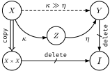

# Kernel-Hom

[](https://github.com/gaetanserre/KernelHom/actions/workflows/build-doc.yml)

Lean 4 project focused on tactics that translate kernel equalities into categorical equalities, and back. This work is still in early stages, but the core tactics are already implemented and can be used to simplify kernel equalities by leveraging categorical reasoning.

<p align="center">
  
</p>

For more information, see [the project homepage](https://gaetanserre.fr/KernelHom) and the full documentation [here](https://gaetanserre.fr/KernelHom/doc).

## Status

This repository is mainly about the tactics `kernel_hom` and `hom_kernel`.

They are built on top of `SFinKer`, the category of measurable spaces with s-finite kernels as morphisms. This categorical layer is the key reason the tactic workflow works.

Very briefly, the tactics:

- translate an equality of s-finite kernels into an equality in categorical/monoidal form,
- let you run category-theory tactics such as `coherence` or `monoidal`,
- translate the result back to a kernel equality.

Universe handling is part of this translation: expressions are lifted to a common universe level, so rewrites stay well-typed across universe levels.

In addition, `SFinKer` also gives a direct route to `Stoch`, the Markov category of measurable spaces and Markov kernels, defined as the wide subcategory of `SFinKer` with Markov kernels as morphisms. The definitions/results for `SFinKer` and `Stoch` are now in Mathlib (PR [#36779](https://github.com/leanprover-community/mathlib4/pull/36779)).

## Kernelized monoidal composition

One consequence of the translation to `SFinKer` is that one can adapt the categorical monoidal composition `⊗≫` to kernels, resulting in a kernelized monoidal composition `⊗≫ₖ`. This composition automatically handles measurable equivalences, allowing for seamless composition of kernels while maintaining s-finiteness.

## Usage

Add this in your `lakefile.toml`:

```toml
[[require]]
name = "kernelhom"
git = "https://github.com/gaetanserre/KernelHom"
```

If you're using a `lakefile.lean`, add:

```lean
require verso from git "https://github.com/gaetanserre/KernelHom"@"latest"
```

## Examples

See [Examples](https://gaetanserre.fr/KernelHom/Usage-and-examples/#Kernel-Hom___-Tactics-for-Categorical-Kernel-Reasoning--Usage-and-examples) for examples of how to use the tactics.

## Reference

- Tobias Fritz. *A synthetic approach to Markov kernels, conditional independence and theorems on sufficient statistics*. Adv. Math. 370 (2020), 107239. [arXiv:1908.07021](https://arxiv.org/abs/1908.07021).

## License

GNU GPL 3.0. See [LICENSE](LICENSE).