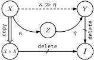
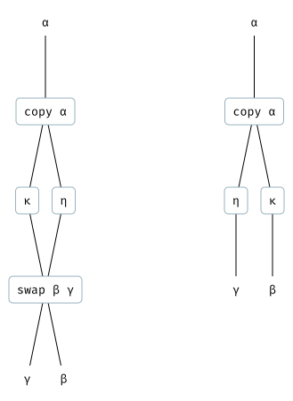

# Kernel-Hom

[](https://github.com/gaetanserre/KernelHom/actions/workflows/build-doc.yml)

Lean 4 project focused on tactics that translate kernel equalities into categorical equalities, and back. This work is still in early stages, but the core tactics are already implemented and can be used to simplify kernel equalities by leveraging categorical reasoning.

<p align="center">
  
</p>

For more information, see [the project homepage](https://gaetanserre.fr/KernelHom) and the [full documentation](https://gaetanserre.fr/KernelHom/docs).

## Why Kernel-Hom?

The translation of kernels into morphisms of a monoidal category gives access to the tools of category theory for kernels:

- **Proving API lemmas easily.** Equalities of kernels built from compositions, parallel compositions, products, copies, discards and swaps are proved by a single call to `kernel_disch`, the tactic to use by default since it tries both `cat_disch` and `monoidal`, without any knowledge of the lemmas about kernels (see [`KernelHomTests/Examples.lean`](KernelHomTests/Examples.lean)).
- **Visualizing kernels.** The `#kernel_diagram` command and the string diagram widget draw complex kernel expressions as string diagrams, which makes their structure easier to understand.
- **Reasoning by calculation.** A proof can be written as a `calc` whose lines are the mathematically meaningful rewrites, while the structural steps between them are proved automatically by the categorical tactics. Each step can moreover be visualized. In Mathlib, proofs by calculation whose steps are equalities of kernels are rare, and in calculations on measures built from kernels, each structural step is a chain of rewritings with lemmas about kernels and measures. See [`KernelHomTests/Basu.lean`](KernelHomTests/Basu.lean), which formalizes Theorem 15.8 of Fritz, the main ingredient of Basu's theorem, and the [calculational proofs page](https://gaetanserre.fr/KernelHom/Calculational-proofs/) of the documentation, which draws each step of the calculation.

## Status

This repository is mainly about the tactics `kernel_hom` and `hom_kernel`.

They are built on top of `SFinKer`, the category of measurable spaces with s-finite kernels as morphisms. This categorical layer is the key reason the tactic workflow works.

Very briefly, the tactics:

- translate an equality of s-finite kernels into an equality in categorical/monoidal form,
- let you run category-theory tactics such as `cat_disch`, `monoidal` or `coherence` (`kernel_disch`, `kernel_monoidal` and `kernel_coherence` do it directly on kernels),
- translate the result back to a kernel equality.

Universe handling is part of this translation: expressions are lifted to a common universe level, so rewrites stay well-typed across universe levels. When several hypotheses and the goal are translated together (`kernel_hom at h ⊢`), they are all lifted to the same universe level. This part is handled by the `lift_eq` tactic, which can also be used independently (see [the GitHub repository](https://github.com/gaetanserre/EqLift)).

In addition, `SFinKer` also gives a direct route to `Stoch`, the Markov category of measurable spaces and Markov kernels, defined as the wide subcategory of `SFinKer` with Markov kernels as morphisms. The definitions/results for `SFinKer` and `Stoch` are now in Mathlib (PR [#36779](https://github.com/leanprover-community/mathlib4/pull/36779)).

## Additional advantages of the translation to categories

The translation from kernels to categorical expressions allows to use any tool from category theory within the context of kernels, such as string diagram visualization or monoidal composition.

### Kernel diagrams

The library provides the `kernel_diagram` command that generates a string diagram for a given kernel expression. This can be useful for visualizing complex kernel compositions and understanding the structure of kernel equalities.

```lean4
#kernel_diagram ProbabilityTheory.Kernel.swap_prod
```

<p align="center">
  
</p>

### Kernel reassociation

The library also provides the `@[kernel_reassoc]` attribute, which is a variant of `@[reassoc]` that, given a lemma named `F` of shape `∀ .., f = g`, where `f g : Kernel X Y` are s-finite kernels, will create a new lemma named `F_assoc` of shape
```lean
∀ .. {Z : Type u} [MeasurableSpace Z] (ξ : Kernel Y Z) [IsSFiniteKernel ξ], ξ ∘ₖ f = ξ ∘ₖ g
```
It first transforms the kernel equality into a categorical equality in `SFinKer`, then applies the `@[reassoc]` pipeline to generate the reassociated equality, and finally transforms the result back into a kernel equality. It comes with the term elaborator `kernel_reassoc_of%`, the variant of `reassoc_of%`, which applies the same construction to any proof of an equality of s-finite kernels, such as a local hypothesis.

### Kernelized monoidal composition

An additional consequence of the translation to `SFinKer` is that one can adapt the categorical monoidal composition `⊗≫` to kernels, resulting in a kernelized monoidal composition `⊗≫ₖ`. This composition automatically handles measurable equivalences, allowing for seamless composition of kernels while maintaining s-finiteness.

## Implementation

The translation is designed to be cheap: the equivalence between the original kernel equality and its categorical counterpart is proved by congruence from the translation lemmas (`comp_hom`, `parallelComp_hom`, ...) rather than by rewriting, and the terms are built directly with explicit universe levels and instances. Instances (`MeasurableSpace`, `IsSFiniteKernel`, the categorical instances of `SFinKer`), inferred types and recursively built objects (measurable equivalences, objects of `SFinKer`) are memoized in a cache reset at each call of the tactics.

## Usage

Add this in your `lakefile.toml`:

```toml
[[require]]
name = "kernelhom"
git = "https://github.com/gaetanserre/KernelHom"
```

If you're using a `lakefile.lean`, add:

```lean
require kernelhom from git "https://github.com/gaetanserre/KernelHom"@"main"
```

## Examples

See [Examples](https://gaetanserre.fr/KernelHom/Usage-and-examples/#Kernel-Hom___-Tactics-for-Categorical-Kernel-Reasoning--Usage-and-examples) for examples of how to use the tactics, and [Calculational proofs](https://gaetanserre.fr/KernelHom/Calculational-proofs/) for a proof by calculation with the string diagrams of each step.

## Reference

- Tobias Fritz. *A synthetic approach to Markov kernels, conditional independence and theorems on sufficient statistics*. Adv. Math. 370 (2020), 107239. [arXiv:1908.07021](https://arxiv.org/abs/1908.07021).

## Acknowledgements
Some code for the documentation of this project comes from [Yuma Mizuno](https://github.com/yuma-mizuno)'s [documentation on the coherence tactics](https://yuma-mizuno.github.io/coherence-tactics/) (see [LeanDecl.lean](KernelHomManual/Tools/LeanDecl.lean) and [VersoKernelDiagram.lean](KernelHomManual/Tools/VersoKernelDiagram.lean)).

## License

Apache 2.0. See [LICENSE](LICENSE).
